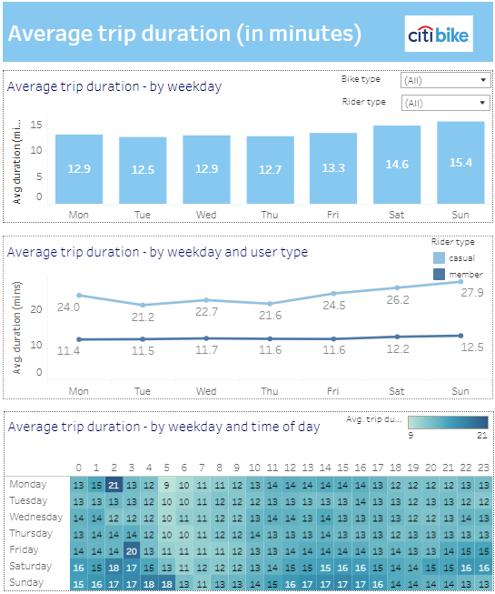

# How are Citi Bikes being used in NYC?

 ### **Overview**
Citi Bike is the largest bike sharing programme in the United States.  This project utilised [data](https://citibikenyc.com/system-data) covering a four month period, December 2022 to March 2023, to understand how Citi Bikes were being used, who was riding them, when and where.

### **Tableau dashboard and story**
Tableau was utilised for the data visualisation.  
Several dashboards were developed, along with a story.
These can be viewed online via [this link](https://public.tableau.com/app/profile/kim.coleman4297/viz/Citi_Bike_Analysis_16847220882990/CitiBikeAnalysisStory)

Below are images of the dasboards created:

### **Report**
 - A written report is available and saved as *Squirrels_NYC_report.pdf*

 

---

### **Contact**
Email: kymcoleman@gmail.com

---